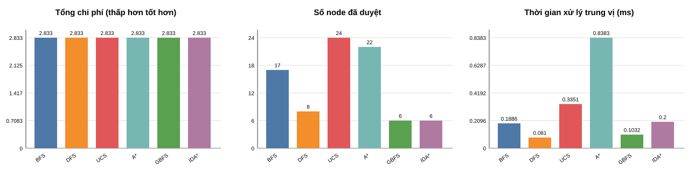

# Kết quả thực nghiệm so sánh thuật toán

## Thiết lập

Thí nghiệm dùng **đồ thị con cảm sinh gồm đúng 30 node và 48 cạnh** từ dataset giao thông hybrid của dự án (các địa điểm thực tế, điều kiện giao thông mô phỏng tái lập). Cặp điểm đầu-cuối là `1003` -> `25`, profile chi phí là `balanced`. Như vậy toàn bộ phần thực nghiệm tuân theo yêu cầu kiểm thử trong khoảng 30 node. Mỗi thuật toán chạy 101 lần trên cùng tiến trình; thời gian trong bảng là trung vị của trường `processing_time_ms`, do đó giảm ảnh hưởng của dao động hệ điều hành. Chi phí tuyến là tổng chi phí chuẩn hoá theo hàm: khoảng cách 0,30; thời gian cơ sở 0,45; độ trễ do kẹt xe 0,15; rủi ro 0,10.

## Bảng so sánh lý thuyết

Ký hiệu: `V` là số node, `E` là số cạnh, `b` là hệ số phân nhánh và `d` là độ sâu nghiệm. Bộ nhớ trong bảng là bộ nhớ phụ của thuật toán, không tính graph đầu vào.

| Thuật toán | Độ phức tạp thời gian | Bộ nhớ | Tính hoàn chỉnh | Tính tối ưu với chi phí giao thông không âm |
|---|---|---|---|---|
| BFS | O(V + E) | O(V) | Có, trên graph hữu hạn | Không; chỉ tối ưu số chặng khi mọi cạnh có cùng chi phí |
| DFS | O(V + E) | O(V) | Có, trên graph hữu hạn với tập visited | Không |
| UCS | O((V + E) log V) với binary heap | O(V) | Có | Có |
| A* | O((V + E) log V) trong hiện thực graph-search; phụ thuộc chất lượng heuristic | O(V) | Có | Có khi heuristic admissible và consistent |
| GBFS | O(b^d) trong trường hợp xấu nhất | O(b^d) | Có trên graph hữu hạn của chương trình; không bảo đảm trong không gian vô hạn | Không |
| IDA* | O(b^d) trong trường hợp xấu nhất | O(d) theo IDA* chuẩn | Có | Có khi heuristic admissible |

Các độ phức tạp trên mô tả phiên bản lý thuyết, không tính dữ liệu đầu vào và trace phục vụ animation của GUI. Trong mã nguồn này, heuristic A* là Haversine được nhân hệ số lower bound nên admissible/consistent. IDA* tiền xử lý chi phí còn lại trên đồ thị đảo để tạo lower bound chính xác; bước này tốn O((V + E) log V) thời gian và O(V + E) bộ nhớ, vì vậy lợi thế bộ nhớ O(d) của IDA* chuẩn không còn hoàn toàn đúng cho hiện thực này.

## Hiệu suất thực tế

| Thuật toán | Node đã duyệt | Quãng đường (km) | Thời gian đi (phút) | Tổng chi phí | Thời gian xử lý trung vị (ms) |
|---|---:|---:|---:|---:|---:|
| BFS | 19 | 0.960 | 2.881 | 3.0417 | 0.2489 |
| DFS | 10 | 0.960 | 2.881 | 3.0417 | 0.1336 |
| UCS | 24 | 0.960 | 2.881 | 3.0417 | 0.3666 |
| A* | 22 | 0.960 | 2.881 | 3.0417 | 0.8636 |
| GBFS | 8 | 0.960 | 2.881 | 3.0417 | 0.1429 |
| IDA* | 8 | 0.960 | 2.881 | 3.0417 | 0.3387 |

**Bàn luận.** Tuyến có `tổng chi phí` thấp nhất là tuyến phù hợp nhất với profile đã chọn; không nên chỉ nhìn quãng đường vì hàm mục tiêu còn tính thời gian, kẹt xe và rủi ro. UCS, A* và IDA* phải cho cùng chi phí tối ưu trên đồ thị này. GBFS thường duyệt ít node do chỉ bám heuristic khoảng cách, nhưng không bảo đảm tối ưu nên cần đối chiếu tổng chi phí trước khi dùng. BFS tối ưu số chặng, còn DFS phụ thuộc thứ tự cạnh; vì vậy cả hai có thể tạo tuyến có chi phí giao thông cao hơn. Số node đã duyệt phản ánh lượng không gian tìm kiếm: ít node hơn thường nhanh hơn, nhưng không tự nó chứng minh tuyến tốt hơn. Thời gian xử lý ở cỡ mili-giây và phụ thuộc cấu hình máy; so sánh hợp lệ khi chạy cùng máy, cùng graph, cùng profile và cùng số lần lặp như trên. Vì các thuật toán chạy rất nhanh ở đồ thị 30 node, phần chênh lệch mili-giây chủ yếu phản ánh chi phí quản lý hàng đợi ưu tiên và heuristic, không phải thời gian di chuyển ngoài thực tế.

## Tác động của kẹt xe

Để kiểm tra độ nhạy với kẹt xe, giữ nguyên cặp điểm `1003` -> `25` và profile `balanced`. Kịch bản `rush_hour` cộng một mức congestion cho mọi loại đường (giới hạn mức 5). Bảng dưới dùng UCS; A* và IDA* cũng chọn cùng nghiệm tối ưu do cùng hàm chi phí.

| Trạng thái | Tuyến | Quãng đường (km) | Thời gian đi (phút) | Tổng chi phí |
|---|---|---:|---:|---:|
| Bình thường - tuyến tối ưu | `1003 -> 1019 -> 42 -> 41 -> 33 -> 34 -> 24 -> 25` | 0.960 | 2.881 | 3.0417 |
| Giờ cao điểm - giữ tuyến cũ | `1003 -> 1019 -> 42 -> 41 -> 33 -> 34 -> 24 -> 25` | 0.960 | 3.661 | 3.2367 |
| Giờ cao điểm - tuyến tối ưu mới | `1003 -> 1019 -> 42 -> 43 -> 45 -> 36 -> 30 -> 1028 -> 29 -> 25` | 0.976 | 3.356 | 3.2328 |

Khi giờ cao điểm làm tuyến cũ bị phạt congestion, thuật toán tối ưu đánh giá lại tổng chi phí thay vì giữ đường ngắn theo hình học. Nếu tuyến tối ưu mới dài hơn nhưng có tổng chi phí thấp hơn tuyến cũ trong cùng kịch bản giờ cao điểm, kết quả xác nhận hệ thống đã né đoạn kẹt xe đúng theo hàm mục tiêu. A* và IDA* dùng hàm chi phí giống UCS nên phải cho cùng tuyến tối ưu sau khi thay đổi congestion. Không diễn giải đây là “đường ngắn nhất tuyệt đối”; đây là tuyến có chi phí tổng hợp nhỏ nhất theo trọng số đã công bố.
